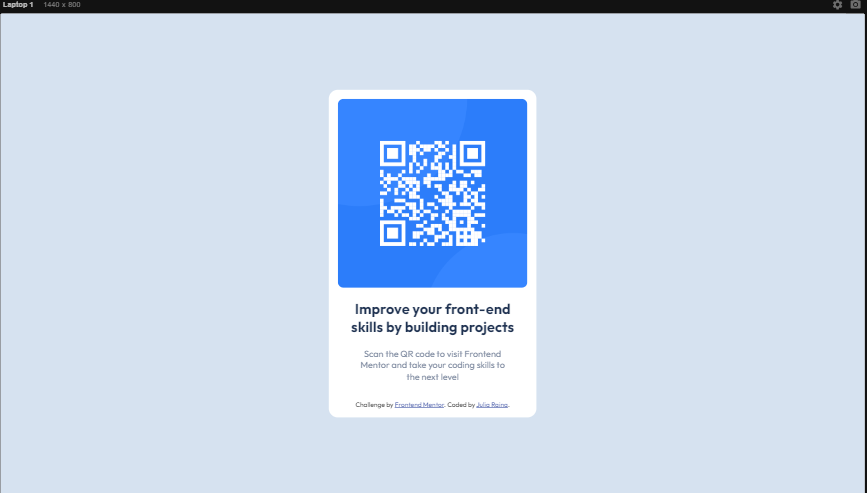

## Welcome! 👋

Thanks for checking out this front-end coding challenge.

# Frontend Mentor - QR code component solution

This is a solution to the [QR code component challenge on Frontend Mentor](https://www.frontendmentor.io/challenges/qr-code-component-iux_sIO_H). Frontend Mentor challenges help you improve your coding skills by building realistic projects.

## Table of contents

- [Overview](#overview)
  - [Screenshot](#screenshot)
  - [Links](#links)
- [My process](#my-process)
  - [Built with](#built-with)
  - [Useful resources](#useful-resources)
- [Author](#author)

## Overview

### Screenshot

### Links

- Solution URL: [Solution URL here](https://github.com/juliaraina/qr-code-component)
- Live Site URL: [Live site URL here](https://juliaraina.github.io/qr-code-component)

## My process

### Built with

- Semantic HTML5 markup
- CSS custom properties
- Media queries
- Flexbox
- Without Figma

### Useful resources

- [Using media queries](https://developer.mozilla.org/pt-BR/docs/Web/CSS/CSS_media_queries/Using_media_queries) - This helped me with Media Queries. I really liked this pattern and will use it going forward.

## Author

- Frontend Mentor - [@juliaraina](https://www.frontendmentor.io/profile/juliaraina)
